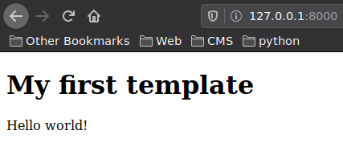
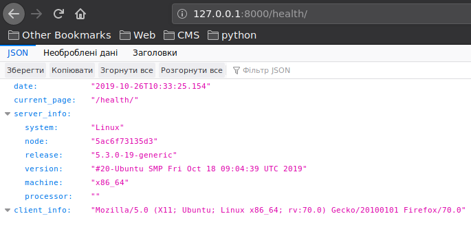

# Lab_4: Робота з Docker

1. Для перевірки чи докер встановлений і працює правильно на віртуальній машині запускаю перевірку версії, виведення допомоги та тестовий імедж: 
        
        docker -v
        docker -h
        docker run docker/whalesay cowsay Docker is fun
    
    Перенаправляю вивід цих команд у файл `my_work.log` та роблю коміт із ним до репозиторію.
2. Для знайомства з Docker створюю імедж із Django сайтом зробленим у попередній роботі.  
   * Оскільки проект на Python то і базовий імедж також потрібно вибрати відповідний. Всі імеджі можна знайти на Python Docker Hub. Використовую команду щоб завантажити базовий імедж з репозиторію:
         
           docker pull python:3.7-slim
           docker images
           docker inspect python:3.7-slim
           
   * Створюю файл з іменем `Dockerfile`, копіюю туди вміст такого ж файлу з репозиторію `devops_course`;
   * Ознайомлююсь із коментарями та структурою написання `Dockerfile`;
   * Замінюю посилання на власний Git репозиторій із веб-сайтом та роблю коміт даного `Dockerfile`.
3. Створюю власний репозиторій на Docker Hub. Для цього логінюсь у власний аккаунт на Docker Hub після чого переходжу у вкладку Repositories і далі натиснкаю кнопку `Create new repository`. Називаю його `lab4-examples`.
4. Виконую білд (build) Docker імеджа та завантажую його до репозиторію. Для цього вказую правильну назву репозиторію та TAG. Команда буде виглядати так (де django - це тег):
   
       docker build -t vovataras/lab4-examples:django .
       docker images
       docker push vovataras/lab4-examples:django
       
    [Посилання на Docker Hub репозиторій](https://cloud.docker.com/repository/docker/vovataras/lab4-examples);
    
    Посилання на скачування імеджа: `vovataras/lab4-examples:django`;
5. Для запуску веб-сайту потрібно виконати команду:
   
        docker run -it --name=django --rm -p 8000:8000 vovataras/lab4-examples:django
   
    * переходжу на адресу http://127.0.0.1:8000 та переконуюсь що веб-сайт працює:
    
    
    
    
6. Оскільки веб-сайт готовий і працює, потрібно створити ще один контейнер із програмою моніторингу веб-сайту:
    * створюю ще один Dockerfile в якому поміщу програму моніторингу 
    
    * виконую білд даного імеджа та даю йому тег monitoring;
    
    * запускаю два контейнери одночасно (у різних вкладках) та переконуюсь що програма моніторингу успішно доступається до сторінок веб-сайту (використовую ключ --net=host);

    * роблю коміт файлу Dockerfile.site та результати роботи програми моніторингу запущеної з Docker контейнера;

