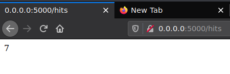
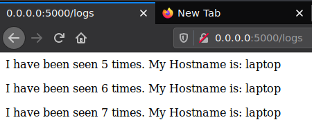
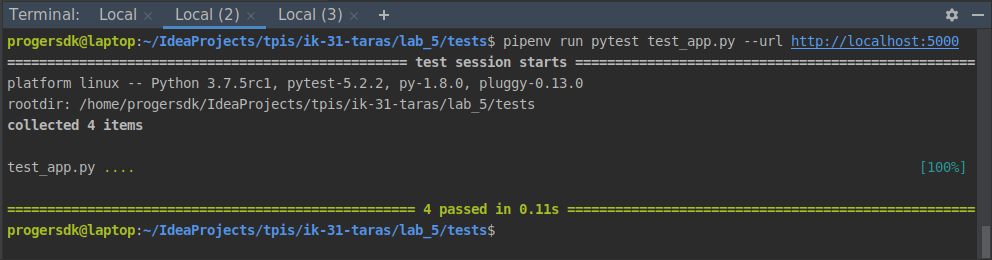
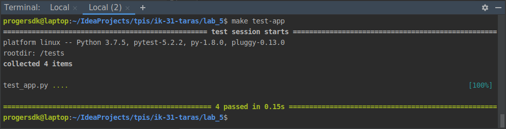
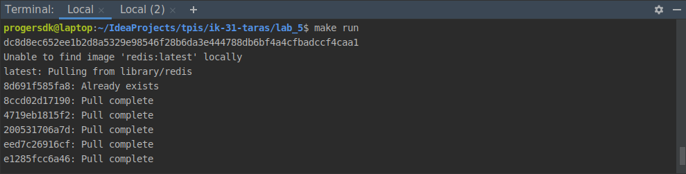
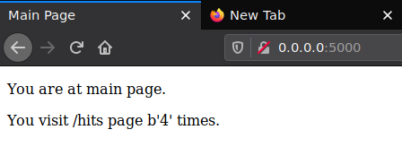
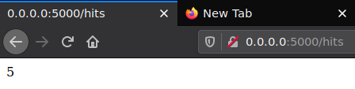
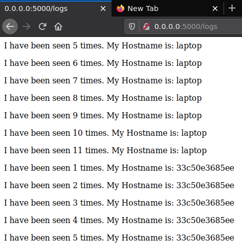
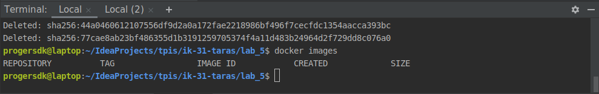

# Lab_5: Автоматизація за допомогою Makefile VS Docker Compose

## Makefile
1. Створюю папку `my_app` в якій буде знаходитись проект. Створюю папку `tests` де будуть тести на перевірку працездатності проекту. 
2. Копіюю файли з репозиторію `devops_course` у відповідні папки свого. Ознайомлююсь із вмістом кожного з файлів.
3. Пробую чи проект є працездатним перейшовши у папку та після ініціалізації середовища виконую команди записані нижче:

        pipenv --python 3.7
        pipenv install -r requirements.txt
        pipenv run python app.py
    
    * Проте появляється помилка при перегляді сторінок сайту: `redis.exceptions.ConnectionError`. Проблема полягає в тому, що відсутій `redis-сервер` і сайт не може доступитись до нього;
    * Встановлюю `redis-сервер` використовуючи команду `sudo apt-get install redis-server`;
    * Після встановлення в мене він запустився самостійно, проте для запуску використовується команда `sudo systemctl start redis`;
    * Також прописую `127.0.0.1 redis` в `/etc/hosts`, тому, що система не може зрозуміти `'redis'` при підключенні до сервера;
    * Після цього головна сторіна працює:
    
    
    * Сторінки `/hits` та `/logs` не працюють, оскільки відсутня папка `logs` в папці з додатком, тому створюю її;
    * Після цього сторінки `/hits` та `/logs` працюють:
    
    
    
      
4. Так само можна ініціалузувати середовище для тестів у іншій вкладці шелу та запустити їх командою:
    
        pipenv run pytest test_app.py --url http://localhost:5000
    
    * Тести пройшли успішно:
    
     

5. Видаляю файли які постворювались після тестового запуску (`Pipfile` та `Pipfile.lock`, а також папку `.virtualenvs`).
6. Щоб середовище було чистим, все буде створюватись і виконуватись всередині `Docker`. Створюю два `Dockerfile` з іменами як у репозиторію `devops_course` та `Makefile` який допоможе автоматизувати процес розгортання.
7. Ознайомлююсь із вмістом `Dockerfile` та `Makefile` та його директивами. 
    * `STATES` та `REPO` це змінні, які містять назви тегів та назву репозиторія відповідно;
    * Директива `.PHONY` підставляючи значення з змінної `STATES` викликає директиву `$(STATES)`;
    * `$(STATES)` можна викликати просто підставляючи назву тегу і призначена для білду Docker Image;
    * `run` для запуску сайту та `redis`;
    * `test-app` для запуску тестів;
    * `docker-prune` для очищення ресурсів Docker;
8. Для початку, використовуючи команду `make` створюю Docker імеджі для додатку та для тестів:
        
        make .PHONY 
        
9. Запускаю додаток та перейшовши в іншу вкладку шелу запускаю тести. 
    * Тести пройшли успішно:
    
    
    
    
    
    * Сторінки сайту:
    
    
    
    
    
    
    
10. Зупиняю проект натиснувши `Ctrl+C` та чищу всі ресурси `Docker` за допомогою `make`.

        make docker-prune
        
11. Створюю директиву в `Makefile` для завантаження створених імеджів у Ваш `Docker Hub` репозиторій. Завантажую імеджі до репозиторію:
        
        make push
        
    [Репозиторій Docker Hub](https://hub.docker.com/repository/docker/vovataras/lab5-examples/general)

12. Також видаляю створені та закачані імеджі. Створюю директиву в `Makefile` яка автоматизує процес видалення імеджів.

    
    