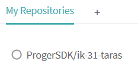

# Lab_6: Автоматизація за допомогою CI/CD серверів.

1. Реєструюсь на сайті Travis. Налаштовую інтеграцію з GitHub та додаю свій репозиторій:
    
    
    
2. Для того щоб Travis знав які кроки потрібно виконати над кодом у кореневій папці даного репозиторію створюю файл `.travis.yml` та копіююю туди вміст з `devops_course`. Travis повинен автоматично знайти даний файл та виконувати ці кроки при кожному новому коміті в `master` гілку.
3. 